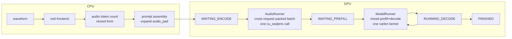

# VoiceAgent

Cloud-edge ASR–LLM–TTS voice agent. The inference engine in this tree is `qwen-asr-vllm`.

# qwen-asr-vllm

A self-contained inference engine for Qwen3-ASR with continuous batching, including
across the audio encoder. No dependency on `vllm`, on the `qwen_asr` research
package, or on `transformers` recognising the `qwen3_asr` model type.

On LibriSpeech test-clean (64 clips), one A100-40GB, Qwen3-ASR-0.6B:

| backend | concurrency | RTF | audio sec/sec | WER | CER |
|---|---|---|---|---|---|
| qwen-asr-vllm | 1 | 0.0148 | 67.7 | 0.0324 | 0.0101 |
| qwen-asr-vllm | 8 | 0.0051 | 197.6 | 0.0324 | 0.0101 |
| qwen-asr-vllm | 32 | **0.0021** | **483.0** | 0.0324 | 0.0101 |
| reference (transformers `generate`) | 1 | 0.1288 | 7.8 | 0.0324 | 0.0098 |

**8.7x at matched concurrency, 62x at the engine's best**, with word error rate identical
to the reference. Character error rate differs in the fourth decimal, so the outputs are
not byte-identical — a handful of clips punctuate differently.

An earlier revision of this table claimed 88x against a reference measured at 4.9 audio
sec/sec. Re-measured on an idle host the reference does 7.8, so that ratio was inflated
by load on the machine rather than by anything the engine does. The honest figure is
lower and still large.

Two independent things produce it, and they respond to different workloads. Continuous
batching is the concurrency column: 67.7 to 483.0 audio seconds per second as in-flight
requests go from 1 to 32. CUDA graph replay of the decode step lifts the whole column,
concurrency 1 included, by 4-9x — see
[Decode was CPU-bound, not GPU-bound](#decode-was-cpu-bound-not-gpu-bound).

Those numbers are short-clip numbers. On whole recordings the engine sustains 55x
realtime for a 21-minute TED talk at concurrency 1, and the balance of cost moves
somewhere else entirely — see [Where the time actually goes](#where-the-time-actually-goes).

## Environment

This is not a portability note, it is a correctness one. **The engine requires a
working `flash-attn` build**, and refuses to start without one rather than falling
back.

The fallback is what makes the difference: without flash-attn, attention degrades
to a per-sequence Python loop with explicit matmul and softmax, costing an order of
magnitude. Earlier measurements suggesting that nano-vLLM's ASR path was *slower*
than plain HuggingFace were made in an environment where this had happened. That
environment (`/opt/conda/envs/qwen3-asr`) has `torch 2.12.1+cu130` against a driver
that supports at most CUDA 12.2, so `torch.cuda.is_available()` returns `False` and
`flash_attn` is absent. Numbers taken there say nothing about architecture.

Verified working: `/opt/conda/envs/nano-vllm` — torch 2.5.1+cu121, flash-attn 2.8.3,
transformers 4.57.6.

```bash
/opt/conda/envs/nano-vllm/bin/pip install -e '.[bench,serve,test]'
```

`datasets` 5.x decodes audio through `torchcodec`, which has no build for this torch
version. `bench/data.py` therefore loads the audio column undecoded and hands it to
`soundfile`.

## Usage

```python
from qwen_asr_vllm import AsrEngine

engine = AsrEngine("/mnt/llm_data/voice_ckpt/Qwen3-ASR-0.6B", max_num_seqs=32)
outputs = engine.transcribe(waveforms)          # list of float32 numpy arrays @ 16kHz
for output in outputs:
    print(output.language, output.text)
```

Forcing the language skips the metadata line the model would otherwise emit, and
`context` supplies a system prompt for hotword biasing:

```python
outputs = engine.transcribe(waveforms, language="en", context="acme, widget, sprocket")
```

For streaming or interleaved submission, drive the loop directly:

```python
for waveform in waveforms:
    engine.add_request(waveform)
while engine.scheduler.has_work:
    for output in engine.step():
        print(output.text)
```

`gpu_memory_utilization` is a fraction of memory **still free after the weights
load**, not of the card's total capacity — on a shared GPU a fraction-of-total
budget would mean something different every run.

## Command line

```bash
# a directory of clips, all submitted at once so the scheduler can batch them
qwen-asr-vllm transcribe --model /path/to/Qwen3-ASR-0.6B --language en ./clips/
qwen-asr-vllm transcribe --model ... --output-format json --output-file out.json ./clips/

qwen-asr-vllm serve --model /path/to/Qwen3-ASR-0.6B --port 8000
```

`transcribe` submits every file before waiting on any of them. Looping one file at a
time would leave the batch nearly empty, which is the whole thing the engine exists
to avoid.

## Serving

```bash
qwen-asr-vllm serve --model /path/to/Qwen3-ASR-0.6B --port 8000
```

`POST /v1/audio/transcriptions` follows OpenAI's endpoint, so existing SDKs work
unchanged:

```bash
curl -s localhost:8000/v1/audio/transcriptions \
    -F file=@clip.wav -F language=en -F response_format=verbose_json
```

```json
{"text": "concord returned to its place amidst the tents.", "language": "English",
 "duration": 3.4, "usage": {"input_tokens": 61, "output_tokens": 12},
 "timings": {"queue_seconds": 0.001, "encode_seconds": 0.012, "total_seconds": 0.09}}
```

Two additions to that endpoint, both for things it has no field for. `context`
supplies the hotword system prompt. `timeout` bounds the request server-side, which
matters because under load a request's time goes into the queue, and a client-side
socket deadline cannot cancel work already accepted — the engine drops it and returns
504.

| route | purpose |
|---|---|
| `POST /v1/audio/transcriptions` | transcribe; `json`, `text` or `verbose_json` |
| `GET /health` | 200 while the engine loop lives, 503 once it does not; reports queue depth and free KV blocks |
| `GET /metrics` | Prometheus text: request counters, latency and audio-duration histograms, scheduler counters, KV occupancy |
| `GET /v1/models` | the loaded checkpoint |

### Concurrency model

`AsrEngine` is single-threaded on purpose — the scheduler, block manager and KV cache
are plain mutable state, and locking them would buy nothing an inference loop wants.
So serving wraps it instead of making it thread-safe:

```
caller threads          worker pool             loop thread
submit(waveform) --> mel + prompt build --> admit, step, deliver
```

Exactly one thread ever touches engine state, and a test asserts it. Splitting the
frontend out is not only lock hygiene: mel extraction is pure CPU, and inline it left
the GPU idle for its duration; on a worker it overlaps with the encode and decode
steps of requests already in flight.

`AsyncAsrEngine` is usable directly, without HTTP:

```python
from qwen_asr_vllm.engine.async_engine import AsyncAsrEngine

with AsyncAsrEngine(model=path) as engine:
    handles = [engine.submit(waveform, timeout=30) for waveform in waveforms]
    for handle in handles:
        print(handle.result().text)
```

Cancellation works at any stage. A request still queued is dropped immediately; one
already inside the batch being executed cannot be pulled out of a running kernel, so
it is flagged and dropped when that step lands. Either way the caller's future raises
`RequestCancelled` rather than returning a partial transcription.

## Architecture



Three things differ from the nano-vLLM ASR path this replaces.

**Audio encoding is a scheduling stage, batched across requests.** Several
recordings are packed into one encoder call sharing a single `cu_seqlens`, so one
long recording no longer holds up everything queued behind it. Cross-request audio
batching cut encoder wall time 4x in the sweep above (1.11s to 0.28s going from
concurrency 1 to 32).

**Prefill and decode share a batch.** The previous scheduler ran either all-prefill
or all-decode steps, so an arriving request made every in-flight request idle for a
step. Here attention is one `flash_attn_varlen_func` call over the paged cache where
decode is simply a query length of one, and FlashAttention's bottom-right causal
alignment gives both kinds the right mask. 12-23% of steps in the sweep were mixed.

### Dual-stream encode∥decode

Optional same-thread CUDA-stream overlap for audio encode ∥ text decode
(`enable_dual_stream=True` / CLI `--dual-stream`). Default **off**. When on, the
engine uses overlap-eligible schedule order (schedule both batches, execute, then
admit) and forces eager decode until graphs are captured on the decode stream.
Design and Phase 1 bench:
`docs/superpowers/specs/2026-08-20-asr-dual-stream-overlap-design.md`.

```bash
qwen-asr-vllm transcribe --model /path/to/Qwen3-ASR-0.6B --dual-stream --language en ./clips/
/opt/conda/envs/nano-vllm/bin/python bench/dual_stream_overlap.py --mode both \
  --num-samples 32 --max-num-seqs 8
```

**Prefix caching is decided per block, not globally.** Audio positions all carry the
same `<|audio_pad|>` id, so two different recordings hash identically while holding
completely different KV — and because prefix hashes chain, one audio block poisons
every block after it. The previous code responded by switching prefix caching off
entirely for audio requests. Instead, each request reports how many leading blocks
are purely textual, and only those participate. That keeps reuse for the case that
pays: a long shared system prompt used for hotword biasing.

Single GPU only. Qwen3-ASR ships at 0.6B and 1.7B; tensor parallelism would be
complexity with nothing to buy.

### Decode was CPU-bound, not GPU-bound

A decode step is a few hundred tiny kernels, and at 0.6B none of them is big enough
to hide its own launch cost. Profiling the decoder at batch 4 measured **37ms of CPU
dispatch per step against 7.9ms of GPU time** — the card was idle five sixths of the
step, waiting to be told what to do next. Batch assembly was not the problem; that
measured 0.2ms, under 1% of the step. The cost was spread across the ops themselves.

Replaying a captured CUDA graph issues the whole step as one launch:

| | per decode step | audio sec/sec @ conc 1 | @ conc 8 | @ conc 32 |
|---|---|---|---|---|
| eager | 27.6ms | 10.0 | 62.0 | 96.3 |
| CUDA graph | **3.9ms** | **60.4** | **159.0** | **482.7** |

WER is unchanged, and `tests/test_cuda_graph.py` holds it there: the gate is
token-level equality with the eager path on real audio, not a tolerance on logits. A
graph freezes tensor addresses and a couple of shape parameters, so its failure modes
are all quiet ones — a stale block table, padding rows bleeding into real attention, a
baked-in maximum length silently truncating a long context. None of those raise; they
just change the transcription.

Only decode is captured. Prefill query lengths vary continuously, which would need a
graph per length, and prefill kernels are large enough that dispatch is already
amortised — the imbalance is specific to decode's one-token steps. Batch size is the
one thing that legitimately varies, handled by capturing a graph per size bucket and
padding up to the next; padding rows get a slot mapping of `-1`, which the KV write
kernel skips, and their outputs are discarded. `enforce_eager=True` turns all of it
off.

The `@torch.compile` decorators on RMSNorm, SiLU and rotary embedding survived the
same scrutiny and earn their keep: disabling them takes CPU from 37ms to 49ms and GPU
from 7.9ms to 20.8ms per step, because they fuse the elementwise chains.

### Under pressure

Three failure paths that a throughput benchmark on a large card never reaches, so
they are driven directly against a deliberately tiny cache instead:

**Preemption.** When running requests cannot all grow, the newest is preempted so the
oldest keeps going. Its blocks are released and its prefill will repeat, but its audio
embeddings are kept — the encode stage is never repeated.

**Requests that can never fit.** The prefill loop stops at the first request it cannot
place, which is right for transient pressure since blocks free as decodes finish. But
a request needing more blocks than the cache holds in total has nothing to wait for,
and would leave the scheduler reporting work forever while producing empty batches — a
hang, not an error. Those are aborted with `aborted:kv_cache_too_small`.

**Running out of memory mid-step.** Tokens are appended and blocks extended in
`postprocess`, which does not run if the forward pass raises, so a failed batch can be
put back exactly as it was and retried under a halved cap that recovers on success. A
batch of one that still fails has nowhere left to shrink and is given up on with
`aborted:out_of_memory`.

## Accuracy on whole recordings

Short-clip parity was checked from the start and always passed. It turned out to be the
easy half. The engine exists for audio 40x longer than those clips, and an error that
only appears once the audio occupies thousands of KV slots — a wrong `cu_seqlens`, an
attention kernel that quietly falls back, a token cap that truncates — passes every
short-clip test there is. This project has already shipped one such regression: SDPA
ignoring `cu_seqlens`, 78% relative WER, found by accident.

`bench/eval_longform.py` scores 1.56h of whole TED talks, 187s to 1299s each, against
their transcripts. Scoring uses Whisper's `EnglishTextNormalizer` rather than the
simpler one used for LibriSpeech, because real transcripts spell numbers out: a
reference reading "twenty seven kilometers" against a hypothesis reading "27
kilometers" is two errors on a correct recognition. Both sides canonicalise to the same
form, so these numbers are comparable with published ones.

| model | backend | corpus WER | sub | ins | del | ref words |
|---|---|---|---|---|---|---|
| 0.6B | qwen-asr-vllm | **0.0270** | 249 | 105 | 125 | 17725 |
| 0.6B | reference (transformers `generate`) | 0.0273 | 251 | 105 | 128 | 17725 |
| 1.7B | qwen-asr-vllm | **0.0212** | 185 | 87 | 103 | 17725 |

**Engine against reference on the same audio: 0.0012 word disagreement**, 21 edits over
17702 words. That is the number that says whether we introduced anything, with the
model's own errors cancelling on both sides. All eight talks stop on EOS; none hits the
token cap.

Accuracy does not decay with length. The four longest recordings (908-1299s) score
0.0259 against 0.0308 for the four shortest (187-381s), and the worst single recording
is 381s of hard content at 0.0538 — where the engine and the reference disagree by two
substitutions out of 79 edits, so it is the material, not the length and not us. 1.7B
buys most of its 21% relative gain on exactly the recordings that are hardest for 0.6B:
the 1299s talk goes 0.0407 to 0.0257, while that stubborn 381s one barely moves.

`tests/test_longform_wer.py` holds this as a gate, about two minutes on one GPU. A gate
that has never been observed to fail is not a gate, so it was checked against an
injected fault: reverting the token cap to its flat default takes corpus WER from 0.0270
to **0.8300** and three of the four assertions fail with the truncated recordings named.
That injection also showed the truncation bug was worse than assumed — at roughly 3.5
tokens per audio second a 440-token cap covers about 125s, so even the 187s talk was
being cut, scoring 0.4146.

## Where the time actually goes

`bench/profile_stages.py` times each stage with CUDA events, one request at a time so
that no two stages share a kernel launch. A100-40GB, bf16. The long-form fixture is the
eight whole TED talks in `tedlium_long_form`, 187s to 1299s, transcribed at their
recorded length — real spontaneous speech rather than short clips stitched together.
`max_new_tokens` is raised to 16000 because the 440-token default silently truncates
anything past a few minutes; a 1299s talk needs about 4900 tokens.

Device seconds for the 0.6B model:

| audio | T_conv | T_AuT | T_proj | T_prefill | T_decode | decode share |
|---|---|---|---|---|---|---|
| 187s | 0.012 | 0.008 | 0.000 | 0.027 | 2.344 | 98.0% |
| 336s | 0.022 | 0.014 | 0.000 | 0.047 | 4.267 | 98.1% |
| 908s | 0.060 | 0.032 | 0.000 | 0.185 | 10.981 | 97.5% |
| 1105s | 0.073 | 0.038 | 0.000 | 0.253 | 13.626 | 97.4% |
| 1299s | 0.085 | 0.044 | 0.001 | 0.335 | 20.332 | 97.8% |

TTFT below is measured from the request entering the queue, so it excludes the CPU mel
extraction that runs before the request object exists. That omission is not small at
long durations: adding `T_Fbank` back puts real first-token latency at 963ms for 0.6B
and 1178ms for 1.7B on the 1299s talk, and makes the CPU frontend 49% and 41% of it —
more than every GPU stage before the first token combined.

| audio | audio tok | out tok | TTFT 0.6B → 1.7B | RTF 0.6B | tok/s 0.6B | ms/step 0.6B → 1.7B | KV |
|---|---|---|---|---|---|---|---|
| 187s | 2437 | 728 | 49 → 75ms | 0.014 | 272 | 3.2 → 5.1 | 348 MiB |
| 336s | 4372 | 1293 | 87 → 141ms | 0.015 | 264 | 3.3 → 5.2 | 622 MiB |
| 908s | 11801 | 2773 | 289 → 441ms | 0.014 | 222 | 4.0 → 6.0 | 1.56 GiB |
| 1105s | 14360 | 3371 | 379 → 563ms | 0.014 | 217 | 4.0 → 6.1 | 1.90 GiB |
| 1299s | 16885 | 4849 | 487 → 694ms | 0.017 | 215 | 4.2 → 6.2 | 2.32 GiB |

Short clips, where the picture is different, need the stitched LibriSpeech fixture
because no long-form recording is that short (`--dataset librispeech`):

| audio | 2s | 10s | 30s | 120s |
|---|---|---|---|---|
| decode share | 26% | 63% | 86% | 96% |
| TTFT 0.6B | 46ms | 64ms | 40ms | 62ms |
| KV | 5.5 MiB | 20 MiB | 55 MiB | 213 MiB |

### The input/output asymmetry does not land where it looks like it should

By token count the audio side dominates exactly as expected: a 1299s talk is 16885
audio tokens against a 4849-token transcript, about 3.5:1. The natural conclusion is
that the encoder and the long prefill are where the time goes, and that decode
optimisations borrowed from chatbot serving miss the point.

Measured, it is the reverse, and not narrowly: **decode is 97.4-98.3% of device time on
every one of the eight talks, for both model sizes**, and the entire audio tower plus
prefill is under 2.6%. The projector never exceeds 0.3% at any length.

The reason is that the two sides are not paid for in the same currency. Prefill consumes
16885 audio tokens in one pass at 50,400 tokens/s. Decode produces 4849 tokens one
sequential step at a time at 238 tokens/s — **211x worse per token**, because every step
re-reads the whole model to produce a single token. Three and a half times as many tokens
on the audio side cannot outweigh a 211x difference in the cost of each one.

The crossover sits between 2s and 10s of audio. Below it the front of the pipeline
really does dominate (74% at 2s), which is where the intuition comes from — that is the
length of a typical short ASR clip. It stops holding almost immediately after.

Read audiobook speech turned out not to flatter the result either, which was the obvious
thing to suspect: decode time is proportional to emitted tokens, and a TED speaker who
pauses says 3.21 words per second where a LibriSpeech narrator says 4.89. But spontaneous
speech tokenises less efficiently — 1.16 tokens per word against 0.71 — and the two
effects cancel almost exactly, leaving the output token *rate* nearly identical: 3.73/s
on TED against 3.48/s on LibriSpeech. Decode dominance came out marginally higher on the
real recordings.

Concurrency does not rescue it either, which is the interesting part: decode steps
batch across requests while encoder work is per-request, so the balance should tilt
forward as concurrency rises. It does, far too slowly to matter
(`bench/profile_concurrency.py`, 120s clips, 0.6B):

| concurrency | 1 | 2 | 4 | 8 | 16 | 32 |
|---|---|---|---|---|---|---|
| decode share | 95% | 96% | 94% | 91% | 85% | 81% |
| encoder + prefill | 5% | 4% | 6% | 6% | 9% | 10% |
| tokens/s | 318 | 418 | 638 | 994 | 1406 | 1740 |

So the CUDA graph work above was not a chatbot optimisation applied to the wrong
problem; decode is the problem, at every duration and concurrency tested.

### What the asymmetry does change: by 20 minutes, decode is reading KV, not weights

A decode step at batch one reads the decoder's weights plus the whole KV cache to emit
one token, so its floor is memory bandwidth. Where that floor sits moves with audio
length, because the KV cache is what grows:

| model | audio | weights | KV | KV share of bytes | achieved | of A100's 1555 GB/s |
|---|---|---|---|---|---|---|
| 0.6B | 187s | 1.11 GiB | 0.34 GiB | 23% | 483 GB/s | 31% |
| 0.6B | 908s | 1.11 GiB | 1.56 GiB | 58% | 724 GB/s | 47% |
| 0.6B | 1299s | 1.11 GiB | 2.32 GiB | **68%** | 880 GB/s | 57% |
| 1.7B | 1299s | 3.20 GiB | 2.35 GiB | 42% | 962 GB/s | 62% |

At short lengths 0.6B decode is not bandwidth-bound at all — 31% of peak, which is why
removing launch overhead with CUDA graphs paid so well. By 1299s the same step is at 57%
and **more than two thirds of the bytes it moves are KV cache, not weights**. That
splits the remaining optimisations in two: cross-request batching amortises the weight
read and does nothing for the KV read, so it stops scaling exactly where long audio
begins; KV quantisation or eviction attacks the term that actually grows. Cutting the
sequential step count — speculative decoding against the previous transcript, or any
draft — is the only lever that touches both.

The same 112 KiB per token also caps concurrency before compute does. A 1299s request
holds 2.32 GiB of KV, so a 40GB card fits about **14 concurrent 20-minute requests** at
0.6B and 13 at 1.7B, and those are the batch sizes over which the weight read has to be
amortised. Long-audio serving is memory-limited into precisely the regime where batching
has the least to offer.

### Two things this profiling found by accident

**The KV cache budget ignored the audio tower.** `determine_num_blocks` sized the cache
from free memory after a profiling forward that only exercised the text decoder. But
the convolutional downsampler widens 128 mel bins to 480 channels before the strides
shrink them, so one `conv_chunksize` slice holds about 1.4 GiB. Nothing raised: the KV
cache simply took the memory first, and the encoder then ran in whatever was left.
The symptom was the downsampler taking **1547ms instead of 27ms** for the same shape at
`gpu_memory_utilization=0.9`, pure allocator churn, with no error to explain it. The
profile run now encodes a worst-case audio batch too, which costs about 11% of the KV
blocks and is what the encoder was always using.

**Torch's default thread count made the mel frontend 100x slower than it needed to be.**
`WhisperFeatureExtractor` builds the spectrogram from a chain of small torch CPU ops. On
this 48-core host torch defaults to 24 intra-op threads, and at that width the OpenMP
barrier around each op costs far more than the op itself:

| threads | 2s clip | 30s | 120s | 1200s |
|---|---|---|---|---|
| 24 (default) | 122.6ms | 169.3ms | 49.0ms | 574.3ms |
| 8 | **1.2ms** | **5.4ms** | 40.8ms | 547.8ms |
| 1 | 1.6ms | 17.5ms | 130.4ms | 1829.0ms |

For a 2s clip the frontend was costing more than every GPU stage combined. Long clips
are insensitive, so a low cap wins across the range; `EngineConfig.frontend_threads`
defaults to 8 and only ever narrows the pool.

## Streaming session

Python API for agent integration. Same events for all policies:
`partial` / optional `committed` / `final`. Default policy is **`speculate`**
(WER-preserving draft acceleration). Prefer that over `incremental` when quality matters.

```python
from qwen_asr_vllm.engine.async_engine import AsyncAsrEngine

engine = AsyncAsrEngine(model=...)
session = engine.open_stream(language="en")  # chunk_policy="speculate"
for event in session.feed(pcm_chunk):
    ...
for event in session.close(reuse_last=True):
    ...
```

| policy | behaviour | quality / latency |
|---|---|---|
| `speculate` (default) | growing-prefix + previous transcript tokens as draft | WER ≈ retranscribe; wall **1.4–2.7×** faster |
| `retranscribe` | full growing-prefix each feed | quality baseline; slowest |
| `incremental` | unlocked tail + sliding-window recompute | much less audio; **WER regresses** (~10×); logs a warning |

`incremental` uses bounded revision: most chunks transcribe
`buffer[committed_audio_end:]`; every `recompute_seconds` (default 6) a window with
`recompute_overlap_seconds` (default 2) is re-transcribed so recent wording can
change. Committed text is not silently rewritten (`commit_violation` instead).
Omitting `commit_lag_words` defaults to 16 under incremental (0 otherwise). This is
an agent latency tradeoff, not longform-WER parity with full re-transcribe.

Specs: `docs/superpowers/specs/2026-08-10-asr-streaming-session-design.md`,
`docs/superpowers/specs/2026-08-10-asr-incremental-streaming-design.md`.

`bench/compare_streaming_policies.py` defaults to `retranscribe,speculate`
(gt WER, wall clock, RTF, draft accept, policy-gap WER). 0.6B, 2s chunks:

| session | retranscribe WER / wall / RTF | speculate WER / wall / RTF | gap WER | wall speedup | draft accept |
|---|---|---|---|---|---|
| Libri contiguous ~116s | 0.0332 / 45.9s / 0.395 | 0.0332 / 17.3s / 0.149 | 0.000 | **2.65×** | 0.678 |
| TED whole talk 187s | 0.0254 / 124.8s / 0.666 | 0.0271 / 89.0s / 0.475 | 0.0017 (1/591) | **1.40×** | 0.294 |

Libri: transcript identical to retranscribe. TED: one-edit gap vs baseline;
gt WER still in the same band. Artifact: `results/streaming_speculate_vs_retranscribe.json`.

For the latency-only path, add `--policies ...,incremental`. Under default knobs
(`commit_lag=16`, `recompute=6s`) Libri/TED incremental WER jumps to ~0.33–0.35
with ~0.08–0.14× audio sent and wall RTF ~0.06 — fast, but not WER-safe.

## Voice agent runtime

The ASR/LLM/TTS agent flow lives above the ASR engine, so the transcription scheduler
keeps its current batching, KV-cache and CUDA-graph invariants. The runtime wires
streaming ASR events into an injectable streaming LLM backend and an injectable TTS
backend:

```python
from qwen_asr_vllm.agent import NanoVllmStepBatchingBackend, build_voice_factory
from qwen_asr_vllm.server import create_app

llm_backend = NanoVllmStepBatchingBackend(
    model_path="/mnt/llm_data/Qwen3-0.6B",
    device="cuda:2",
    max_num_seqs=4,
)
voice_factory = build_voice_factory(
    llm=llm_backend,             # nano-vLLM add_request/step batching backend
    tts=my_tts_backend,          # implements synthesize(text) -> encoded audio bytes
    llm_trigger="final",         # answers the whole utterance; do not use committed
    asr_kwargs={"language": "en", "chunk_policy": "speculate"},
    async_mode=True,             # queue-driven resident runners + event queue
    tts_flush_chars=20,          # optional low-latency fragment flush
    tts_coalesce_chars=80,       # merge queued fragments while TTS is busy
)
app = create_app(asr_engine, voice_factory=voice_factory)
```

`WS /v1/voice/sessions` is enabled only when `voice_factory` is passed. The client
sends `{"type":"start"}`, binary float32 PCM chunks at 16 kHz, then
`{"type":"close"}`. The server emits JSON events (`asr_partial`, `asr_committed`,
`asr_final`, `llm_chunk`, `tts_chunk`, `done`); when a `tts_chunk` has audio, the JSON
metadata is followed by one binary audio message.

When `voice_factory` is enabled, `GET /agent-latency` serves a browser latency
console for the same WebSocket. It can stream microphone PCM in real time or send
an uploaded audio file at a configurable real-time chunk cadence, then reports
first ASR, LLM start, first returned TTS audio, total session latency, input-audio
duration, post-input ASR/TTS waits, LLM duration and TTS wait. The page can also
load local LibriSpeech samples through `GET /agent-latency/datasets`, stream the
selected sample in real time and show its golden ASR transcript with browser-side
WER/CER against the returned ASR final text. TTS has no dataset waveform golden in
this repo, so the page shows the LLM text sent into TTS and the returned audio
chunks with WAV duration/byte metadata.

This is the migrated scheduling boundary from the old voice assistant app:
LLM output is consumed as a stream and stable sentence fragments are sent to TTS.
The LLM is triggered on ASR `final` so it answers the whole utterance.
`--llm-trigger committed` is a research flag only: with the shipped gate it
prompted the LLM with the first committed word of a 22-word utterance and never
revised. `NanoVllmStepBatchingBackend` keeps one nano-vLLM engine resident
and batches concurrent chat streams through `add_request`/`step`; `build_voice_factory`
detects it as a resident runner and does not wrap it in the generic generator mux.

For timing work, `bench/voice_agent_timing.py --mode fake` measures the scheduling
ceiling without model dependencies. Real async timing always runs ASR, LLM and TTS
behind process-isolated runners to avoid Torch/nano-vLLM global-state conflicts.
The LLM process path uses `ProcessNanoLlmBackend`, which keeps one resident LLM
service process and demultiplexes concurrent `chat_stream` calls by request id so
`NanoVllmStepBatchingBackend` can batch them through `add_request`/`step`. The
timing harness uses the local `QwenTtsBackend` directly for TTS instead of the
old app wrapper.

### Low-latency voice responses: use the `low-latency` profile

The streaming path exists but shipped switched off. The profile that is safe to
quote answers the **whole utterance** (`llm_trigger=final`), keeps the custom
outer talker engines off, and turns on codec-step TTS:

```bash
ASR_NUM_KVCACHE_BLOCKS=128 LLM_NUM_KVCACHE_BLOCKS=64 LLM_TEMPERATURE=0 \
/opt/conda/envs/nano-vllm/bin/python bench/voice_agent_timing.py \
  --mode real --real-target async --runtime-profile low-latency \
  --audio results/cuda0_librispeech_sample.wav
```

Paired regression on this host, same 8.25 s LibriSpeech input, identical prompt
and identical reply across arms. Quote the range, not a single ratio: the two
naive arms already differ by `1.31x` from thermal drift.

| arm | first audio | total turn | tts_rtf | prompt == final transcript |
|---|---|---|---|---|
| naive (`compat`) | 15870.3 ms | 15872.3 ms | 2.644 | yes |
| **`low-latency`** | **3602.2 ms** | **9968.9 ms** | **1.369** | **yes** |
| naive (repeat) | 12142.8 ms | 12143.7 ms | 1.940 | yes |

**First audio 3.37x–4.41x, total turn 1.22x–1.59x.** Withdrawn from earlier
revisions of this page: `17.6x` / `31.7x` (one-word `committed` prompt),
`8.2x–10.4x` (quiet candidate vs unrecorded-host baseline), and a `2.8x` table
that mixed a cool-host TTS RTF of `0.752–0.936` with a different recipe.

**A TTS real-time factor below 1.0 is the number that matters**, more than first
audio: above 1.0 the agent falls further behind the longer it speaks. On the
throttled A100s in this chassis that factor stays about `1.3`. It drops below
`1.0` when TTS runs on the edge 4090; see [Cloud-edge split](#cloud-edge-split).

### When TTS runs above real time: `--tts-playback-preroll-ms`

Above RTF 1.0 the agent does not merely finish late, it **stutters**, and RTF
does not show it. Replaying the chunk timeline against a player that starts on
the first chunk and consumes audio in real time, on a throttled host at RTF
`1.313`: playback opens with `160 ms` buffered, starves `1589.7 ms` later and
ends `1056.4 ms` in deficit, so gaps run through the whole reply. Holding the
opening chunks until a buffer exists converts that into a later, gapless start:

```bash
/opt/conda/envs/nano-vllm/bin/python bench/voice_agent_timing.py \
  --mode real --real-target async --runtime-profile low-latency \
  --audio results/cuda0_librispeech_sample.wav --realtime-input \
  --tts-playback-preroll-ms 1200
```

| paired arms, same window | first audio after stop | tts_rtf | worst buffer | heard |
|---|---|---|---|---|
| preroll off | 765.4 ms | 1.313 | -1056.4 ms | starves |
| preroll 1200 ms | 2443.6 ms | 1.318 | +160.0 ms | **gapless** |

Prompt, reply text and total audio (`5040.0 ms`) are identical, so the gate only
changes delivery. `summarize_voice_timing.py` reports `buffer` and `gapless` per
arm, since equal RTF can still mean one arm breaks up and the other does not.

It defaults to off, for two reasons. On a quiet host at RTF `0.936` the buffer
already grows monotonically and the gate would only add latency. And **the
required preroll grows with reply length** — the deficit is about `0.21` of reply
duration here, so a 30 s reply would need roughly `6.3 s` of preroll. Preroll
buys gapless short replies on a throttled host; only RTF below 1.0 fixes replies
of any length.

### Speculative LLM prefill is not worth building

Prefilling the LLM on committed ASR text during speech, and sampling only after
`asr_final`, is semantically sound but caps out at `~35.5 ms` of a `6990.6 ms`
post-speech wait, or `0.51%`: the prompt is ~30 tokens, and decode is
conditioned on the full prompt by definition and cannot move. ASR also revises
committed prefixes (measured `"Montfichet"` becoming `"Montfiche"`), so the
speculative cache needs revision detection and a re-prefill path. TTS is `96.5%`
of that wait; spend the effort there.

Two things dominate. **Never set `LLM_ENFORCE_EAGER=true`** — it is an obsolete
workaround for a graph-capture failure that no longer reproduces, and it costs
`8.6x` on nano-vLLM decode (`113.4ms` vs `13.2ms` per chunk), which shows up as
`25.9x` on the LLM-to-first-sentence segment. Second, **leave the two custom
outer talker engines off.** Both are regressions on output-matched profiling
(identical codec SHA-256): TTS RTF `1.390` upstream versus `3.141` for
`--tts-outer-active-prefix-talker-engine` and `8.659` for
`--tts-outer-cuda-graph-talker-engine`. Five contention-controlled end-to-end
pairs put the active-prefix regression at `2.39x` (median RTF `3.137` versus
`1.312`), and it buys no first audio in exchange.

### Do not use `--llm-trigger committed`

It looks like the biggest win available and it is not a win at all. With the
shipped gate (`--min-committed-words 1`) it fires as soon as ASR commits its
first word, so on a 22-word utterance the LLM was prompted with the single word
`"Have"`:

| trigger | prompt the LLM saw | first audio | reply |
|---|---|---|---|
| `final` (default) | all 22 words | 3194.2 ms | `"Yes, the boy wills the item, and Montfiche feels too ill to oppose it."` |
| `committed` | `"Have"` | 994.3 ms | `"Yes, I can help with that. What would you like to ask?"` |

The `3.2x` is the agent answering a different, much easier question, and
`_llm_started` means it never revises, so the wrong answer is what the user
hears. Gating to 15 of 22 words does not rescue it: the reply is still wrong and
latency falls back to `2569.6 ms`. `bench/voice_agent_timing.py` now records
`details.llm_prompt` and its parity gate compares it, so this class of "speedup"
cannot pass unnoticed again.

`low-latency` also sets `--barge-in-policy after-asr-final`. Whenever first audio
can arrive before the user stops speaking, the tail of the *same* utterance trips
energy barge-in, cancels the turn, and makes the LLM answer twice. That is the
bug `--defer-tts-audio-until-asr-final` was hiding, so the profile turns deferral
off and fixes the policy instead. With `llm_trigger=final` the overlap cannot
happen for the triggering utterance, but the policy stays because any faster TTS
or an earlier trigger brings it straight back.

Incremental ASR ingest is **not** a latency fix. It measured `1913.5ms` against
`1716.5ms` for the same configuration, because ASR leaves the critical path once
it commits at about `390ms`. Use it for ingest cost and concurrency headroom.

### Speedup against a naive implementation

`--real-target sync` is the pre-streaming design: transcribe the whole
utterance, then run the LLM to completion, then synthesize each sentence with a
blocking call. Because nothing overlaps, first audio equals total time.

This host varies by about `2x` depending on the external tenant, so the baseline
is measured *beside* the candidate. Both arms use `--llm-trigger final` and
produce the same reply. The numbers to quote are the paired range in
[Low-latency voice responses](#low-latency-voice-responses-use-the-low-latency-profile):
**3.37x–4.41x first audio, 1.22x–1.59x total turn**.

An earlier pair on a busy host read `4.97x` / `5.51x` first audio and `1.78x` /
`1.91x` total. That pair is not withdrawn for semantics — both arms answered the
same 22-word prompt — but it is not the number to cite: it is one thermal
window, and the later bracketing naive arms already move by `1.31x` with no
code change.

Two claims **are** withdrawn. `17.6x` and `31.7x` used `--llm-trigger committed`
and compared a full answer against a one-word-prompt non-answer. `8.2x–10.4x`
compared a quiet-host candidate against a baseline whose host state was
unrecorded.

The more important result is not a ratio. On these A100s the previous profile
and the naive path both ran TTS above real time, so they fell further behind
the longer the agent spoke. Further gains on **total** time have to come from
TTS RTF, not from more ASR/LLM overlap: ASR is already hidden under speech.

### Read every number next to the GPU clock

All four A100s on this node sit in NVML `sw_thermal_slowdown` at 46-53% of their
`1410 MHz` max, at 82-84 C, while drawing only 45% of their power limit. It is a
cooling limit, not a power cap, and it does not clear: one card draws `0 W` and is
still 84 C and throttled, because the whole chassis is heat-saturated by the
neighbouring tenants' sustained load.

That halved clock moves measured throughput by about `1.9x`, which is why numbers
here come in two bands. Two gauges, both now recorded automatically:

- `details.gpu_state` in the timing report: `clock_sm_mhz`, `clock_ratio` and
  decoded `throttle_reasons`. This is the one to quote.
- `asr_rtf` in the cost table, a free proxy because ASR does identical work in
  every arm: `0.15 - 0.21` is a cool node, `0.29 - 0.33` a throttled one.

Do **not** rely on `bench/gpu_contention_probe.py`'s `tflops_best` to tell the
bands apart. A sustained large matmul heats the card into throttle before it
finishes, so it reports the hot steady state whatever it started from, and it read
a flat `~90 TFLOPs` across arms whose real throughput differed by `1.9x`.

Because the throttled state is this node's steady state, the A100-local TTS RTF
to plan around is about `1.3`, not a cool-window `0.75`. The `2.39x` gain from
dropping the custom talker engine holds in both bands. Sub-1.0 RTF is established
on the edge 4090 (see below), not on these A100s.

### Cloud-edge split

Resident edge ASR (`cuda:0`) and TTS (`cuda:1`) on two RTX 4090s, cloud LLM and
coordinator on this host, `--realtime-input`, `low-latency`, same 22-word prompt
and identical TTS bytes (`242316`). ICMP RTT is `0.25 ms`, so this is a
rack-local split, not a WAN.

| | first audio after stop | total turn | tts_rtf | playback |
|---|---|---|---|---|
| all-local paced | 809 ms | 15266 ms | 1.338 | starves (−1142 ms) |
| edge ASR, cloud TTS | 771 ms | 15131 ms | 1.315 | starves (−1066 ms) |
| **edge ASR+TTS, cloud LLM** | **498 ms** | **12141 ms** | **0.747** | **gapless (+160 ms)** |

Isolated 4090 synthesis of the same sentence: `5040 ms` of audio in `3790 ms`,
RTF `0.752`. Moving only ASR does not change first audio, because ASR was
already hidden under speech. A real WAN (`10–50 ms` hop) is still unmeasured;
`tc netem` is required before calling those numbers a WAN result.

Browser verification: `GET /agent-latency` keeps the microphone and speaker on
the client. Start the resident path with `bench/start_edge_resident.sh` on the
edge host and `bench/start_cloudedge_voice_ui.sh` on the cloud.

### ASR chunk size and per-turn cost

ASR ingest cost is set by how much audio each re-decode covers. Same input, and
the ASR hypothesis is byte-identical across all of these:

| chunk-ms | policy | partials | ASR ingest wall | ASR RTF |
|---|---|---|---|---|
| 200 | speculate | 42 | 4347.7 ms | 0.527 |
| 400 | speculate | 21 | ~2750 ms (n=5, tight) | 0.335 |
| **800** | **speculate** | **11** | **871-1881 ms** | **0.106-0.228** |
| 1600 | speculate | 6 | 1327.2 ms | 0.161 |
| 800 | retranscribe | 11 | 4024.7 ms | 0.488 |

`--chunk-ms 800` is the optimum, worth about `1.6x` on median ASR ingest compute
and up to `3.2x` at best; `1600` is worse because each re-decode then covers more
audio than it saves in call count. Keep `speculate`: against `retranscribe` at
the same chunk size it is `4.6x`, because the redundant growing-prefix work is
dominated by re-decoding the **text**, not the audio encoder.

Per-turn stage cost in the best configuration (8.25s in, 2.48s reply out):

| stage | wall per turn | real-time factor | keeps up with speech? |
|---|---|---|---|
| ASR ingest | 870.8 ms | 0.106 | yes, 9.5x realtime |
| LLM generate | 77.4 ms (8.6 ms/token) | n/a | yes |
| TTS synthesize | 3100.2 ms | **1.25** | **no** |

TTS is the stage that does not keep up on the A100s (`1.25` to `1.85` RTF in
those ingest arms). Sustained duplex on that host needs TTS RTF below `1.0`.
On the edge 4090 the same sentence measures RTF `0.747` and plays gapless.

`--llm-trigger committed` is not a latency mechanism to deploy. It prompts the
LLM with a fragment and often a generic reply; see
[Do not use `--llm-trigger committed`](#do-not-use---llm-trigger-committed).

For full local ASR+LLM+TTS timing, install Qwen-TTS into the nano-vLLM environment
without replacing torch/torchaudio:

```bash
/opt/conda/envs/nano-vllm/bin/python -m pip install --no-deps qwen-tts==0.1.1 onnxruntime
apt-get install -y sox
```

The timing harness uses `QwenTtsBackend` directly for local TTS.

Additional probes:

```bash
# Do not add --enforce-eager here; graph replay is 8.6x faster per decode step.
/opt/conda/envs/nano-vllm/bin/python \
  bench/nano_llm_batching_probe.py --concurrency 2 --max-new-tokens 16 \
  --max-num-seqs 2 --no-warmup

# Which GPUs can actually deliver throughput, independent of nvidia-smi's
# utilization counter (this host reports 100% while thermally throttled).
/opt/conda/envs/nano-vllm/bin/python bench/gpu_contention_probe.py

/opt/conda/envs/nano-vllm/bin/python bench/qwen_tts_streaming_probe.py \
  --text '你好，请确认语音系统已经准备好。'
```

The old voice app default `LLM_MAX_NUM_SEQS=1` disables real LLM batching. With
that default, a 4-session probe measured wall 5039.6ms and
`max_step_batch_size=1`. With `--max-num-seqs 4`, the same short-output probe
reached `max_step_batch_size=4` and wall 2968.3ms, about 1.7x better aggregate
wall time, while first token latency rose from ~1.8-1.9s to ~2.5-2.6s because
batched prefill is a larger step. On local Qwen-TTS, both
`non_streaming_mode=True` and `False` returned a single tuple result; `False`
was slightly faster on the short probe (4898.6ms vs 5519.7ms) but did not emit
partial audio before the call completed, so it is not true streaming generation
in the current package.

## Streaming cost: the expensive part is not the cache

`bench/profile_streaming.py` runs a growing audio prefix in 2s chunks under the
re-transcribe policy (now also exposed as `StreamingSession`). 0.6B, contiguous
single-speaker audio.

| | 120s utterance | 300s |
|---|---|---|
| chunks | 60 | 150 |
| chunk latency p50 / p95 / max | 622 / 1212 / 1277ms | 1637 / 3205 / 3404ms |
| chunks missing the 2s budget | 0% | 41% |
| prefill tokens over the session | 48660 | 297150 |
| audio-KV-reuse floor | 2640 (18.4x less) | 6600 (45.0x less) |
| decode tokens to emit a final 441 / 1092-token transcript | 13279 (30.1x) | 82807 (75.8x) |
| device time: encoder / prefill / decode | 2.2% / 4.5% / 93.3% | 1.3% / 1.9% / 96.9% |
| chunks revising an earlier word | 91.7% | 95.3% |
| words actually revised | 1.0% | 0.9% |
| revision depth p50 / p95 / max (words) | 7 / 265 / 297 | 220 / 788 / 833 |

**Ordinary prefix caching genuinely cannot be reused here, for three separate reasons.**
The prompt is `[prefix][audio ...][suffix][transcript ...]`, and a new chunk appends
audio *in the middle* of that layout. Audio tokens keep their positions and attend only
leftwards, so their KV stays valid — but the engine cannot key it: blocks are hashed by
token id, every audio position carries the same `<|audio_pad|>` id, and caching them
would let any two equal-length audios collide. `BlockManager` refuses to hash blocks
containing audio, deliberately. The suffix and transcript then shift right by a chunk's
worth of tokens, so their RoPE-encoded keys are *wrong* rather than stale. And the
transcript is not append-only in the first place, since later audio changes what earlier
audio should have been transcribed as.

**But fixing all of that buys almost nothing.** Perfect audio KV reuse would cut prefill
tokens by 18-45x, and prefill is 1.9-4.5% of device time. The ceiling on the entire idea
is a **2-5% saving**. The cost is decode: the transcript is regenerated from scratch
every chunk, 76x redundantly over a 300s session, and that is 97% of the time.

**The revision data explains why that is hard to fix.** Only about 1% of emitted words
ever change, so the transcript is nearly stable — but 95% of chunks change *something*,
and the change lands a median of 220 words back from the end at 300s. Committing a
prefix and keeping it out of the next decode is the obvious lever, and no bounded lag
makes it safe:

| commit lag | 1w | 2w | 4w | 8w | 16w | 32w | 64w |
|---|---|---|---|---|---|---|---|
| violated (300s) | 72% | 72% | 72% | 70% | 69% | 69% | 67% |

Holding back 64 words still leaves two thirds of chunks wanting to edit inside the
committed region. Revisions are sparse but not local, so a lag-based commit policy
trades correctness for speed at a rate the data does not justify. Something that
re-decodes cheaply, or a model trained to emit monotonically, is the actual
prerequisite — not a better cache.

The baseline also stops being real time well before it stops being useful. Per-chunk cost
grows with the transcript regenerated inside it, so latency climbs linearly with
position: 79ms at the first chunk, 1027ms at chunk 55, and 3.4s by chunk 150. Every
chunk makes its 2s budget at a 120s utterance and 41% miss it at 300s, putting the
break-even point for this policy at roughly 200s of audio.

### Previous-transcript speculation: ~33%, not ~99%

Word stability looked like a free draft. It is not. Speculative decoding accepts a
*prefix*, and a single early token change zeros everything after it. Measured with
`bench/profile_speculation.py` on whole TED audio, 2s chunks, previous chunk's token
ids as the draft, Qwen3-ASR-0.6B:

| utterance | corpus accept | p50 chunk | chunks ≥0.9 | chunks <0.1 | decode steps saved |
|---|---|---|---|---|---|
| 120s | 0.354 | 0.403 | 17/59 | 21/59 | 34% |
| 300s | 0.328 | 0.364 | 31/149 | 45/149 | 32% |

The distribution is bimodal, not clustered around 33%. When the early wording holds,
almost the whole draft lands; when it does not, acceptance collapses to a handful of
tokens. A concrete collapse at 34s→36s: `"TED,"` becomes `"TED"` — one comma, LCP drops
from 148 to 4. SequenceMatcher still reports the transcripts as nearly identical; the
speculative path cannot use any of that similarity past the first disagreement.

`ModelRunner.verify` and the token-level longest common prefix agree on every probed
chunk (temperature 0 makes them the same quantity), and a self-draft of the model's own
greedy output is fully accepted. The mechanism works. The draft is just a weaker signal
than the word-level revision rate suggested. Thirty-two percent fewer decode steps is
still the largest lever left against the 97% decode share — larger than perfect audio KV
reuse (2-5%) — but it is not the near-total skip that 99% word stability seemed to
promise, and wiring it in has to tolerate the bimodal chunk mix.

## Three findings that shaped the design

**The audio tower was already written for packed batching.** Its forward pass takes
a time-concatenated mel tensor plus per-request `feature_lens` and isolates requests
through `cu_seqlens`. Every caller nonetheless drives it one request at a time,
under a comment reading *"audio encoder do not support batch inference to keep
precision"*. It does support it — see below.

**The audio token count has a closed form**, so KV budget is known before the
encoder runs:

```python
def num_audio_tokens(mel_frames):
    full_chunks, tail = divmod(mel_frames, 100)
    return full_chunks * 13 + after_cnn_len(tail)   # 13 tokens per second of audio
```

Verified equal to the upstream helper for every frame count from 1 to 6000. This is
what lets audio encoding be a separate stage: the scheduler can reserve blocks and
build the prompt without waiting to see how long the encoder output turns out to be.

**No official processor is needed.** The feature extractor is a stock
`WhisperFeatureExtractor`; the chat template reduces to a fixed 16-token layout with
one placeholder. `AutoProcessor` returns only a tokenizer here and `AutoConfig`
rejects the `qwen3_asr` model type, so config, prompt and postprocessing are all
implemented directly against `config.json`.

### On that precision comment

Encoding N requests together does *not* reproduce encoding them one at a time bit
for bit. cuDNN selects different convolution algorithms for different batch sizes,
and the resulting one-ULP difference at the convolution output grows to a few
percent relative after eighteen residual layers (cosine similarity ~0.999).

The drift belongs to the model and the hardware, not to batching strategy. Driving
the *reference* encoder with a packed batch reproduces the drift to the digit:

| request | our batch-vs-single | reference batch-vs-single |
|---|---|---|
| 3.5s | 0.01163 | 0.01163 |
| 2.0s | 0.00464 | 0.00464 |
| 7.3s | 0.01657 | 0.01657 |
| 1.05s | 0.02710 | 0.02710 |

So the tests pin what actually matters: our packed output matches the reference's
packed output to under 1e-3, batching costs us no more accuracy than it costs the
reference, and end-to-end WER is unchanged (0.0324 vs 0.0324, with >90% of
transcriptions identical).

Two batch-dependencies in the upstream encoder are removed rather than reproduced:
convolution chunks are padded to the full 100 frames and the attention window is
computed from config, instead of both being inferred from the widest chunk present.
Upstream, a batch in which every recording is under one second would produce
different output than the same recordings encoded separately. For any batch holding
at least one full chunk the two formulations agree exactly.

## Layout

```
qwen_asr_vllm/
├── config.py            # EngineConfig, Qwen3ASRConfig (reads config.json directly)
├── prompt.py            # token id assembly, audio_pad expansion, template cache
├── postprocess.py       # parse_asr_output, repetition guard
├── loader.py            # safetensors -> fused params, fails loudly on any gap
├── metrics.py           # counters, bucketed histograms, Prometheus text export
├── server.py            # OpenAI-compatible HTTP, /health, /metrics
├── cli.py               # transcribe / serve
├── audio/
│   ├── frontend.py      # WhisperFeatureExtractor wrapper -> mel + frame count
│   ├── tokens.py        # closed-form audio token accounting
│   ├── batcher.py       # cross-request packing (chunk lengths, cu_seqlens)
│   └── decode.py        # uploaded container bytes -> mono 16kHz float32
├── layers/              # attention (single varlen path) / norm / rotary / sampler
├── models/
│   ├── audio_encoder.py # audio tower taking a packed cross-request batch
│   ├── qwen3.py         # text decoder
│   └── qwen3_asr.py     # assembly + audio embedding injection
└── engine/
    ├── request.py       # three-stage state machine
    ├── block_manager.py # paged KV + per-block cacheability
    ├── scheduler.py     # three stages, mixed batches, preemption, OOM rollback
    ├── audio_runner.py
    ├── model_runner.py  # eager path + graph dispatch
    ├── graph_runner.py  # decode CUDA graph capture and replay
    ├── engine.py
    └── async_engine.py  # background loop thread, futures, cancel, timeout
bench/                   # concurrency sweep, stage decomposition, three-way compare
tests/
reference/               # upstream modeling code, used only as a numerical oracle
```

## Tests and benchmarks

```bash
cd /home/qwen-asr-vllm
/opt/conda/envs/nano-vllm/bin/python -m pytest -q                          # 178 tests
/opt/conda/envs/nano-vllm/bin/python -m pytest -q -m "not gpu and not checkpoint"  # 134, CPU only

/opt/conda/envs/nano-vllm/bin/python bench/run_bench.py \
    --num-samples 64 --concurrency 1,4,8,16,32 \
    --compare engine,reference,nano-vllm

# accuracy on whole recordings, engine against the reference on the same audio
/opt/conda/envs/nano-vllm/bin/python bench/eval_longform.py --compare engine,reference

# is the decode step launch-bound? the measurement behind the CUDA graph work
/opt/conda/envs/nano-vllm/bin/python -m bench.decode_launch_overhead --model ...
```

Tests marked `gpu`, `checkpoint`, or `dataset` skip themselves when the resource is
absent, so plain `pytest` passes on a CPU-only box and the same command gains coverage on
a GPU one. `QWEN_ASR_MODEL` overrides the checkpoint path.

Two are load-bearing. `tests/test_audio_encoder_parity.py` holds the cross-request
batching premise to the reference implementation, and `tests/test_longform_wer.py` holds
accuracy on 20-minute audio, which is the regime short-clip parity does not reach.
`tests/test_cuda_graph.py` does the same for graph replay. `reference/` is a verbatim copy of the upstream
modeling code, present only as an oracle and never imported by the engine.

## What went back to /home/nano-vllm

Four fixes were cheap enough to backport to the ASR path this replaces, taking it
from RTF 0.1710 to 0.0081 at unchanged WER. See `NANOVLLM_ASR_BACKENDS.md` there for
detail. Prefix caching is now decided per block (a 1330-token shared context reuses 5
blocks where it previously reused none), audio encoding batches across requests, and
the KV budget leaves headroom for the audio tower, which the text-only warmup never
measured.

The fourth is worth stating here because it is the sharpest argument for this
project's insistence on flash-attn. nano-vLLM built the audio tower with
`_from_config`, which defaults to **sdpa** — and `cu_seqlens` is only consumed by the
FA2 branch of upstream's attention, marked as such in a comment. Under sdpa the
`attention_mask` is `None`, so the packed sequence attends to itself with no
isolation: window boundaries within a recording vanish, and once several recordings
share a call, they attend to *each other*.

That is what made batched audio encoding look unusable. WER from the same ablation,
before and after:

| | sdpa | flash-attn 2 |
|---|---|---|
| serial | 0.0241 | 0.0259 |
| concurrent decode, serial encode | 0.0233 | 0.0259 |
| concurrent decode, batched encode | **0.0414** | **0.0259** |
| batched vs serial transcripts equal | 34/64 | 62/64 |

Batching went from "barely faster, 78% relative WER increase" to "3.6x on that stage,
free". Note that the sdpa column is not merely worse — its three rows disagree with
each other, which is the signature of output depending on batch composition. A silent
fallback to a mathematically different attention path is exactly the failure this
engine refuses to have, which is why it will not start without flash-attn.

```bash
/opt/conda/envs/nano-vllm/bin/python bench/backport_ablation.py
```
